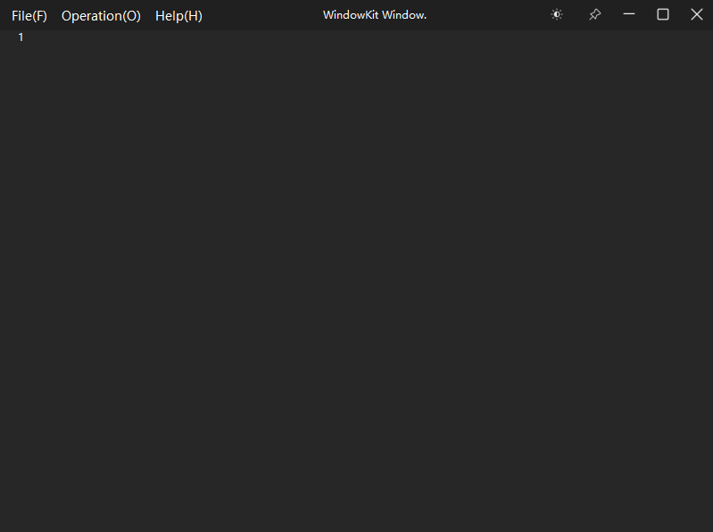

# TSFileTranslator

>Qt的ts文件翻译者，每次处理繁重的翻译工作实在是“费劲”，得益于各种大模型的发展，借助于ai翻译变得非常简单，只需要编写ui，搜集所要翻译的文本并记录对应位置，发送给远端大模型处理，处理完毕进行回填就可以实现自动化翻译了.

## 环境

QtCreator/VsCode

## 编译 & 调试
QtCreator或VsCode打开CMakeLists.txt, 编译&调试即可.